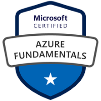

Jeff is an experienced architect for both hybrid cloud and dev(sec)ops.  It began in the early 90's managing travel reservations IT in the day and teaching software to engineering undergrads at night.  Since then, he's been consulting in ERP, CRM, IAM and dev(sec)ops for many clients.  Jeff currently is based near Austin in the Texas Hill Country.  

More details including current contact information are available via 

Jeff holds the following certifications:







Other certifications include:

- CompTIA A+
- CompTIA Network+
- Intel Advanced Networking
